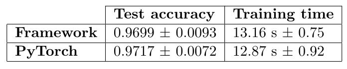
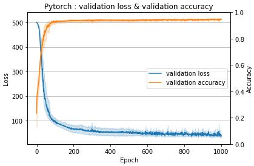

This README is a short overview, for more details, see report.txt.

Authors: Quentin Bouvet, Tobia Albergoni, Matteo Feo

## Goal

Our goal is to re-implement the backpropagation algorithm and evaluate our implementation. This project was carried out as part of a deep learning class.

Concretely, we implement the following components:  
* Layer: Fully-connected   
* Activation Functions: ReLU, Tanh, Logistic sigmoid
* Loss function: MSE
* Optimizer: Mini-batch Stochastic Gradient Descent

For evaluation, we implement neural network using our framework, and identical network using pytorch, and compare the two in terms of training runtime and validation accuracy on a classification task.

## Project Structure

The Fully-Connected layer in implemented in `nn.py`. The ReLU, Tanh and sigmoid activations functions are implemented in `activations.py`. The loss functions are implemented in `losses.py`. 

Layers, Activation functions and Loss functions all inherit from class `Module` and must therefore implement: 
* function `forward(input)`: implements the forward pass of the module, with `input` received from the previous layer. 
* function `backwark(prevGrad)`: implements the backward pass of the module, where `prevGrad` is the gradient of the loss wrt. the output of the last `forward` call of the layer. 
* function `zero_grad`, to reset the gradient accumulators in the module

The optimizer is in `optim.py` and implements a single `step` function. 

Finally, all these classes are coordinated by the `train_model()` function in `utils/training.py`.

## Evaluation and results

We compare two identical networks, one running with our framework, one running in pytorch, on a simple classification task. We report the testing accuracy and the training runtime.

  

  Evaluation and results

The testing accuracy and training runtime of our framework are comparable to that of pytorch, which is positive. 

However, we take a closer look at the validation loss & accuracy during the training iterations. Here, we find quite a bit of difference: we see that pytorch achieves "good" validation loss and accuracy in much fewer epochs. This could be due to different interpertation of parameters, which we were unfortunately not able to track down within before completion of the project.

  
 
 Running with pytorch. 
  

  
 
 Running with our framework. 

